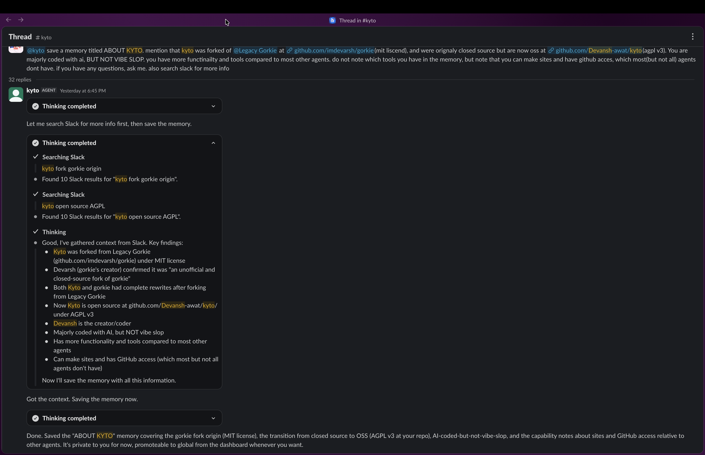

<div align="center">
  
  <h1>Kyto for Slack</h1>
</div>

## Table of Contents

1. [Introduction](#introduction)
2. [Features](#features)
3. [Tech Stack](#tech-stack)
4. [Getting Started](#getting-started)
5. [Project Structure](#project-structure)
6. [Development](#development)
7. [License](#license)

## Introduction

Kyto is an AI assistant for Slack. It replies to mentions, DMs, and threads it
has been invited into, with answers backed by tools: a persistent Linux sandbox,
Slack context, web search, GitHub, email, file uploads, image generation,
scheduled reminders, and static site hosting.

The bot is a long-lived Bun process talking to Slack over Socket Mode through
[`@slack/socket-mode`][socket-mode] and [`@slack/web-api`][web-api] directly —
the Slack harness (routing, threading, markdown, streaming, Block Kit) is this
repo's own code, not a framework. The agent loop is likewise custom, built on
[Vercel AI SDK][ai-sdk]'s `streamText`: a multi-step tool loop with cross-model
fallback, per-attempt stall watchdogs, prompt caching, and mid-turn recovery.
Every Slack thread gets its own [E2B][e2b] sandbox, created lazily and paused
between turns, so files and installed packages survive from one message to the
next.

## Features

- Replies in mentions, DMs, and threads; every message roots its own thread.
- A persistent per-thread E2B sandbox for shell, files, and code execution.
- Cross-model fallback: a turn that dies mid-stream is handed to the next model
  with its work so far replayed as context.
- Slack-aware tools for reading history, searching, posting, reacting, polls,
  canvases, and channel management — with outward-facing posts behind a human
  confirm click.
- GitHub through a host-side proxy: no credential ever enters the sandbox, and
  writes are gated on who owns the repo.
- Web search and page fetching, a real headful browser, and email.
- Image generation, Mermaid diagrams, and file uploads back into the thread.
- Scheduled and recurring reminders, including ones that run a script or a
  whole agent turn.
- Static site hosting, per-user memories, and per-user MCP servers.
- App Home customization: instructions, model keys (BYOK), Sign in with ChatGPT,
  identity, and self-serve data erasure.

## Tech Stack

- [Bun][bun] and TypeScript
- [`@slack/socket-mode`][socket-mode] + [`@slack/web-api`][web-api]
- [Vercel AI SDK][ai-sdk] (`streamText`, `@ai-sdk/openai-compatible`)
- [E2B][e2b] sandboxes
- [PostgreSQL][postgres] + [Drizzle ORM][drizzle]
- [Exa][exa]
- [Turborepo][turbo] and [Ultracite][ultracite]

## Getting Started

Create a [Slack app](https://api.slack.com/apps) from the
[provided manifest](slack-manifest.json) and enable Socket Mode. You will also
need [Git][git], [Bun][bun], a [PostgreSQL][postgres] database, an [E2B][e2b]
API key, and at least one model provider key.

```bash
# Clone this repository
git clone https://github.com/Devansh-awat/kyto.git

# Install dependencies
bun install

# Copy and fill in the bot environment
cp apps/bot/.env.example apps/bot/.env

# Push the database schema
bun run db:push

# Start the Slack bot
bun run dev:bot
```

Socket Mode means the bot never needs a public HTTP tunnel to receive Slack
events. It does serve one public HTTP port of its own, for hosted static sites,
the owner dashboard, and the host-side Slack/GitHub proxies.

See [DEVELOPMENT.md](DEVELOPMENT.md) for the full local setup, sandbox template
notes, and deployment guidance.

## Project Structure

```text
apps/
  bot/        Slack harness, agent loop, features, tools, host-side proxies
docs/         Architecture notes
packages/
  ai/         Attempt/provider setup, prompts, the shared streaming primitive
  db/         Drizzle schema, PostgreSQL client, queries
  logging/    Pino logger factory
  sandbox/    E2B sandbox lifecycle and template builder
  utils/      Shared framework-agnostic helpers
tooling/
  cspell/     Shared cspell configuration
  github/     Reusable GitHub Actions setup
  typescript/ Shared TypeScript configs
```

`apps/bot` is the production runtime. It runs TypeScript directly with Bun and
keeps the Slack connection, the agent loop, the tool surface, and sandbox
coordination in one process.

## Development

Use these checks before handing off changes:

```bash
bun run typecheck
bun run check
bun test
bun run check:spelling
```

Build everything with:

```bash
bun run build
```

Build the sandbox template when sandbox tools, browser dependencies, or CLI
packages change:

```bash
bun run build:template
```

Manual Slack smoke testing is documented in [TESTING.md](TESTING.md).

Architecture notes live in [docs/](docs/). They are Markdown files with
Fumadocs-compatible frontmatter/components and can be previewed with:

```bash
bun run docs:preview
```

## License

Kyto is licensed under the GNU Affero General Public License v3.0 — see
[LICENSE](LICENSE), and [NOTICE](NOTICE) for copyright and attributions. Code
derived from gorkie stays under its original MIT terms
([LICENSE-gorkie-MIT](LICENSE-gorkie-MIT)).

[git]: https://git-scm.com/
[bun]: https://bun.sh/
[socket-mode]: https://tools.slack.dev/node-slack-sdk/socket-mode/
[web-api]: https://tools.slack.dev/node-slack-sdk/web-api/
[ai-sdk]: https://ai-sdk.dev/
[e2b]: https://e2b.dev/
[postgres]: https://www.postgresql.org/
[drizzle]: https://orm.drizzle.team/
[exa]: https://exa.ai/
[turbo]: https://turbo.build/
[ultracite]: https://www.ultracite.ai/
