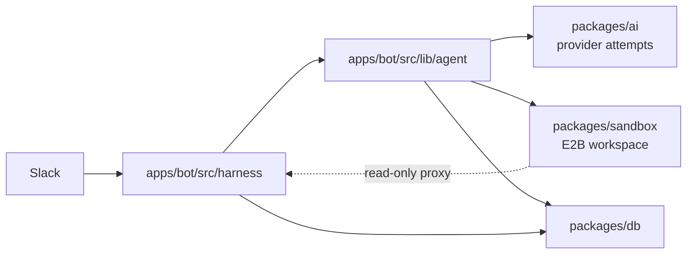

Kyto has three major runtime pieces: Slack, the agent, and the sandbox.

Slack is the interface. The agent is the brain. The sandbox is the workspace.

## Mental Model

The agent loop runs in the bot process. The sandbox is not a daemon and does not
run a copy of the agent — it is a remote Linux box the loop drives through the
`bash`, `readFile`, `writeFile` and `editFile` tools.

That split is what keeps secrets on the host while execution stays isolated:

- model provider keys stay in the bot process;
- Slack and GitHub credentials stay in the bot process — a sandbox reaches
  either service only through a host-side proxy that classifies the request,
  enforces the gates, and attaches the credential itself;
- host tools call Slack, Exa, image generation, and upload APIs directly;
- E2B only handles filesystem and command execution;
- a lost sandbox can be recreated without touching Slack routing.



## Turn Flow

```mermaid
sequenceDiagram
  participant Slack
  participant Bot as apps/bot (harness)
  participant Loop as agent loop
  participant E2B as E2B
  participant DB as Postgres

  Slack->>Bot: message event (Socket Mode)
  Bot->>Bot: routing and ignore checks
  Bot->>DB: thread state, summary, previous thinking
  Bot->>Loop: prompt + tools
  Loop->>Slack: streamed reply and plan card
  Loop->>E2B: create or resume sandbox, run tools
  Loop-->>Loop: fallback to the next model on failure
  Loop->>DB: store thinking, summary, tool state
  Bot->>E2B: pause sandbox
```

## Package Ownership

`apps/bot` owns everything Slack-shaped: the Socket Mode connection and event
routing (`src/harness`), the turn loop and its recovery rules (`src/lib/agent`),
the tool surface (`src/lib/ai`), App Home and interactive features
(`src/features`), and the host-side Slack, GitHub and OAuth endpoints served on
its public port (`src/lib/slack-proxy`, `src/lib/github-proxy`,
`src/lib/slack-oauth`, `src/lib/sites`).

`packages/ai` owns what is not Slack-specific: provider attempts and the
fallback tiers, the system prompts, and `streamAttempt` — the single call every
model request goes through.

`packages/sandbox` owns E2B lifecycle: lazy creation, pause/resume per thread,
the template build, and the shared virtual display.

`packages/db` owns the Drizzle schema, the Postgres client, and queries.

## Code Map

| Area | Files |
| --- | --- |
| Slack connection and event routing | `apps/bot/src/bot.ts`, `apps/bot/src/harness/**` |
| Turn orchestration and fallback | `apps/bot/src/lib/agent/index.ts` |
| The decisions worth testing | `apps/bot/src/lib/agent/{routing,segmentation,carryover,compaction-plan,degenerate}.ts` |
| Prompt assembly and compaction | `apps/bot/src/lib/agent/{prompt,compaction,thinking}.ts` |
| Stream and task rendering | `apps/bot/src/lib/ai/stream/**` |
| Tools | `apps/bot/src/lib/ai/tools/**`, `apps/bot/src/lib/ai/toolset.ts` |
| Gates (approval, confirm-post, GitHub, ownership) | `apps/bot/src/lib/{approvals,confirm-post,github}/**` |
| Host-side proxies | `apps/bot/src/lib/{slack-proxy,github-proxy}/**` |
| Provider attempts and prompts | `packages/ai/src/{agent.ts,providers/**,prompts/**}` |
| E2B lifecycle | `packages/sandbox/src/**` |
| Schema and queries | `packages/db/src/**` |
