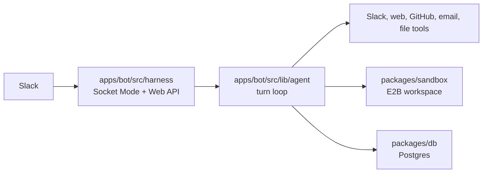

Kyto is an AI assistant for Slack. It can answer normally, read Slack context,
search the web, run code, work with GitHub, create files, generate images, and
upload results back into the conversation.

> **Mental Model:** the agent loop runs on the bot machine. E2B is a remote
> Linux workspace it drives — one per Slack thread, paused between turns.
> Secrets stay on the host: neither the Slack token nor a GitHub credential
> ever enters a sandbox.

Every Slack message roots its own thread, and that thread is the agent's memory
— there is no separate session store. What no longer fits in the replay window
is folded into a running summary instead of being dropped.

## Start Here

- [Architecture](./architecture): boundaries, turn flow, and package ownership.
- [Tools](./reference/tools): the model-facing tool surface and its gates.
- [Prompts](./reference/prompts): how the system prompt is assembled.
- [Data Model](./reference/data-model): what Postgres stores and why.
- [Security](./reference/security): what kyto keeps, and what it refuses to do.
- [Harness assessment](./reference/harness): how this harness compares with the
  coding agents it borrows ideas from.

## Main Flow

1. A Slack `message` event arrives over Socket Mode.
2. `apps/bot/src/bot.ts` decides whether kyto should answer at all — opt-in,
   focus mode, `##` hiding, `<>` addressing, and command prefixes.
3. `buildPrompt` replays the thread, plus a compacted digest of anything older
   and kyto's own thinking from recent turns.
4. The agent loop streams from the first available model, rendering text and a
   live plan card into Slack as it goes.
5. Tools run on the host, or inside this thread's E2B sandbox (created lazily
   on first use).
6. A failure mid-turn falls back to the next model with the work so far
   replayed; a stall trips the watchdog.
7. The sandbox is paused, and what kyto was thinking is stored for next turn.

## Boundaries

- Slack routing, rendering, and the turn loop live in `apps/bot`.
- Provider attempts, prompts, and the shared streaming primitive live in
  `packages/ai`. Nothing Slack-only goes there.
- E2B sandbox lifecycle lives in `packages/sandbox`.
- Schema and queries live in `packages/db`.
- The sandbox never receives model keys, the Slack token, or GitHub
  credentials. It reaches both services only through host-side proxies.
