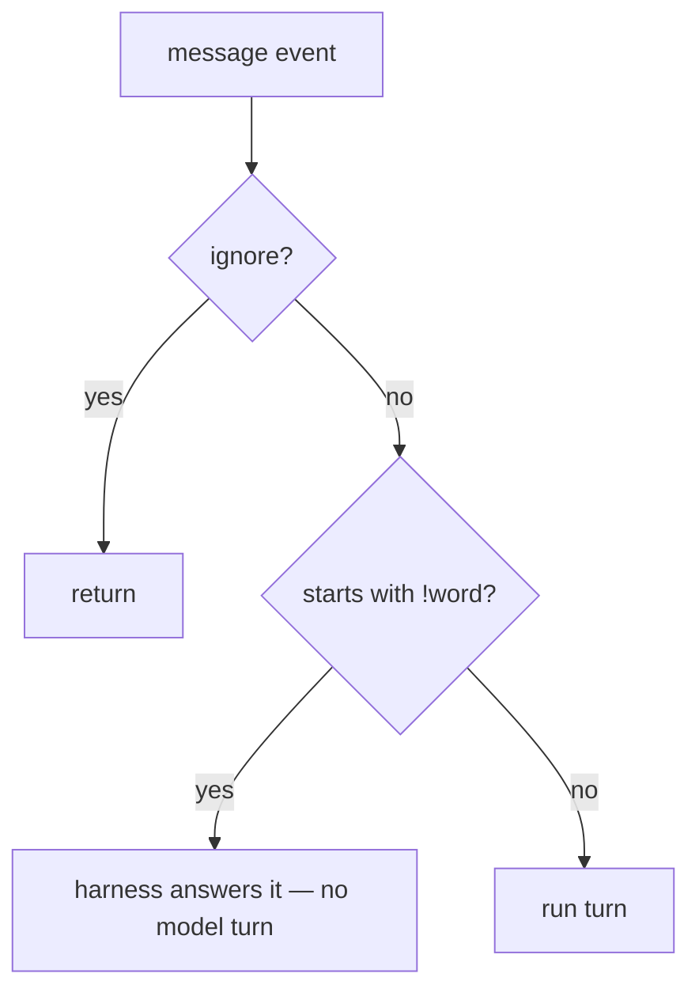

`apps/bot/src/bot.ts` owns the Socket Mode connection and routes every event.
`apps/bot/src/harness/` is the Slack layer under it: the Web API facade, thread
handles, and the mrkdwn↔markdown conversion.

## Entry Points

Everything routes off `message` events. `app_mention` events are deliberately
**ignored** — a mention is just a `message` whose text contains the bot id, and
handling both is what caused the old duplicate-reply problem.

**Every message threads.** A top-level DM or channel message roots its own
thread (`thread_ts = event.thread_ts || event.ts`), and the prompt is scoped to
that thread alone. Kyto therefore has no memory of the rest of a DM by default —
it pulls earlier history on purpose, with `searchSlack`, when it needs it.

## Ignore Rules

- A message that **starts with** `##` (after leading mentions) is invisible: it
  is not answered, and it is filtered out of replayed history. Only the first
  content line counts, so a markdown heading later in a message is fine.
- A message that starts with `<>` is answered **only if kyto was mentioned in
  that same message**. It is a convention for rooms with several bots: address
  the ones you mean, and the others stay quiet. Unlike `##` the message stays in
  context — it suppresses the reply, not the reading.
- Messages from bots, and from kyto itself, are ignored.
- **Kyto never speaks unsolicited.** There is no channel-join greeting: it once
  auto-joined a post-restricted channel, greeted it where normal members cannot
  post, and was banned.

## Commands

A message whose body starts with `!word` is answered by the harness itself —
no model turn, and no interference with a turn already running.

| Command | Effect |
| --- | --- |
| `!focusmode [@people]` | Only those people (and the owner) are seen in this thread. Bare means "focus on me"; `off` clears it. |
| `!secret <question>` | Answered privately: the question is deleted with the asker's own Slack token, the answer is a single ephemeral, and nothing is persisted. |
| `!stop` | Stops the turn currently running in this thread. |

`!` is the only prefix, and an unknown `!word` falls through to a normal turn.

## Access Control

When `OPT_IN_CHANNEL` is set, membership of that channel is the allowlist: the
terms are posted there, and joining is the opt-in. Someone who has not opted in
gets an in-thread "i accept" button instead of an answer.

The member list is cached at startup and extended as people join. Slack has no
member-left event, so someone who leaves keeps access until the next restart —
acceptable over-permission for an opt-in gate.

## Private Context

Reader tools stay scoped to what the asker can already see. A user must not be
able to use kyto to read another user's DM or private channel.
