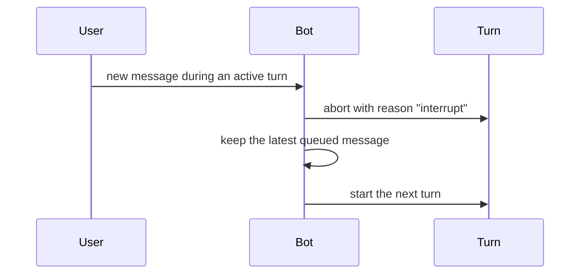

A running turn ends for one of five reasons: it finished, a newer user message
interrupted it, someone stopped it, the watchdog decided it had stalled, or the
process is shutting down. `apps/bot/src/lib/agent/steering.ts` owns the abort
plumbing; `turns.ts` tracks what is active per thread.

## Interruption

A new message in a thread with an active turn aborts that turn and restarts from
the newest queued message.

Only the latest queued follow-up is replayed — earlier messages in the same
burst are superseded by the newest one, and all of them are still in the thread
the next prompt replays.

## Stop

`!stop`, and the stop button on an active response, abort the turn with reason
`stop`. This is the one control that deliberately reaches into a running turn;
every other `!command` is answered by the harness without touching it.

## The Watchdog

Each **attempt** has an idle budget, re-armed on every text delta, tool call and
tool result. It fires only on a genuine stall — a frozen stream or a hung tool —
so a long-but-working turn is never killed. It aborts only the attempt's own
signal, never the turn controller, so a stall is not mistaken for a user
interrupt and the turn can fall back to another model. The `wait` tool extends
it, for a tool that legitimately needs longer.

## Shutdown

Shutdown aborts every active turn with reason `shutdown`. Those turns do not
replay queued messages.

## What Survives

There is no session to park: the Slack thread is the memory. What a turn leaves
behind is the sandbox (paused, and reconnected next turn) and, if it answered,
its thinking — stored so the next turn does not re-derive it. A turn that was
interrupted or stopped leaves no thinking, so a dead end cannot seed the next
turn.
